```{r setup, include=FALSE}
knitr::opts_chunk$set(echo = TRUE)
library(learnr)
library(tidyverse)
```

## Working with other people

The real power of git is the ability to work with others.

Our changes are always recorded **locally**, and we can choose to **share** our changes with others.

Typical work flow:

- **pull** changes from a shared repository to get up to date
- edit, **add**, and **commit** (perhaps mulitple times)
- **pull** again to make sure nothing else has changed, perhaps resolving conflicts
- **push** changes to shared server

Repeat.

## Github

To interact with others, you need a shared server hosting your github project.

GitHub.com has emerged as the leading service (paid for commercial use, free for education and open source projects).

Microsoft purchased GitHub 2018.

We suggest the use of GitHub for coordinating on projects in this class.

## Forking and Cloning, Pushing and Merge Requests

Github adds some additional features on top of git. In addition to nice file browsing, issues tracking, and some automation features they have

- **Forking**: one-click way to clone a public project to your own set of projects
- **Merge request**: a message system where you ask someone to merge in changes from a branch you have created (probably in your own fork of another project)

For our needs, we do not need to use either of these pieces of functionality, but you will see the names pop up. For this class, best just to avoid. Additional details in our Git and GitHub book available on Canvas.


## Directions to Get Set Up

Getting your team ready to collaborate on the project will require the following steps:

- Create an organization (only one student)
- Create a private repository (only one student)
- Create personal access tokens (all students)
- Create posit cloud projects (all students)

## Create an Organization for Your Group

One team member should create an **organization** for your group:

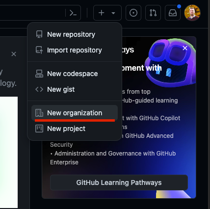

Select the free tier. Give the organization a name. We recommend selecting the "My personal account" option for the "The organization belongs to" question.

Add the other users in the group.


Turn on Personal Access Token support by visiting this link in the Settings link for the organization:


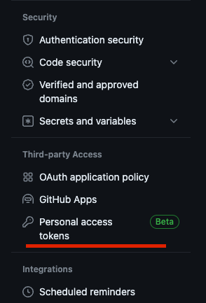

Once there start by clicking continue for step 1. For step two, allow tokens to work immediately:

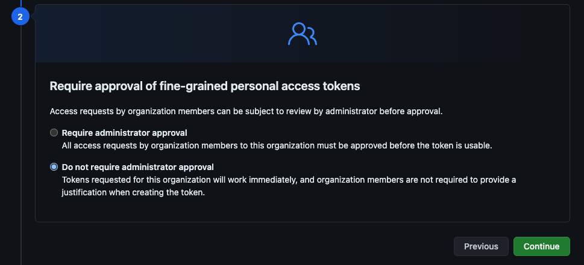

Click continue and finally enroll.

## Create a Private Repository for Your Group

Once team members join the organization, one team member should create a repository:

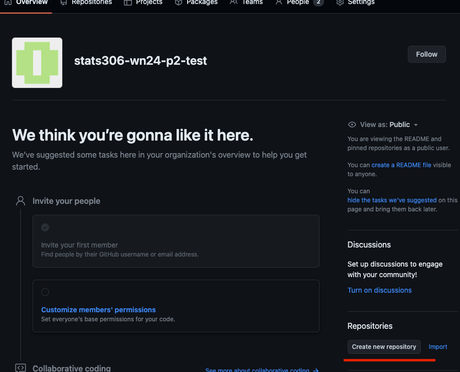

Here are the options (you can select a different name). Make sure you make the organization the owner.

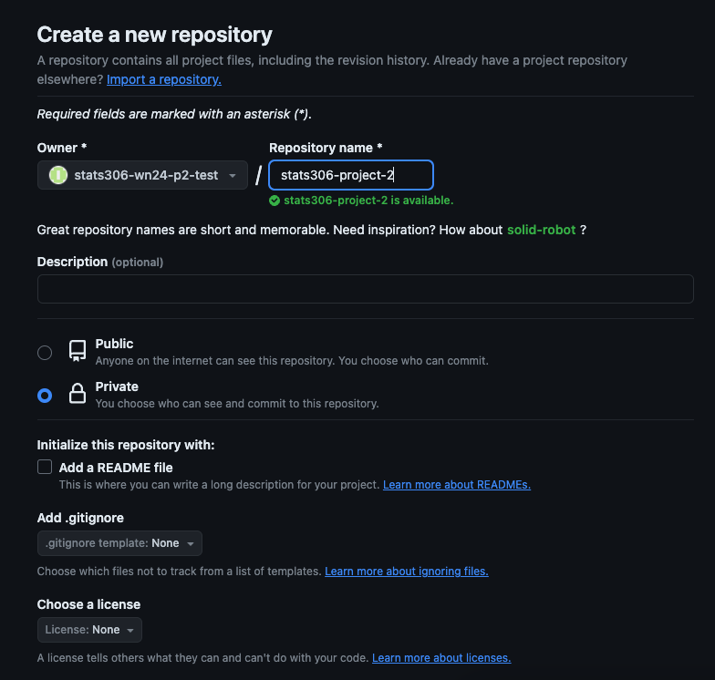

Select the "Private" option.

Do not add a `README`, `.gitignore`, or license file (these will come later).

For the moment, leave the repository empty (i.e., do not follow the directions for how to commit your first files that you will be shown).

Once the repository is created, make sure all users in the organization have access:

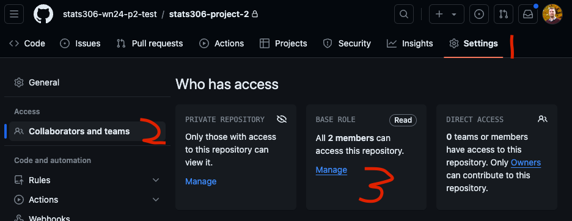

Give all members the base access level of "Read and Write". Click ok for the warning GitHub gives you.

Repository is now ready to be linked in Posit Cloud.

## Creating a Personal Access Token

GitHub's Personal Access Tokens function similarly to passwords for an account but they can be limited to certain repositories and have an expiration date. One user can have more than one PAT, so they can also be easily revoked if they become compromised without having to freeze the entire account.

Each team member will need to create a PAT with permissions to view and edit the shared repository.

To do so, go to you user icon and select Settings

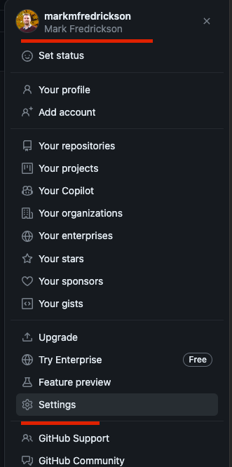


On the left hand side of the screen, select "Developer Settings".

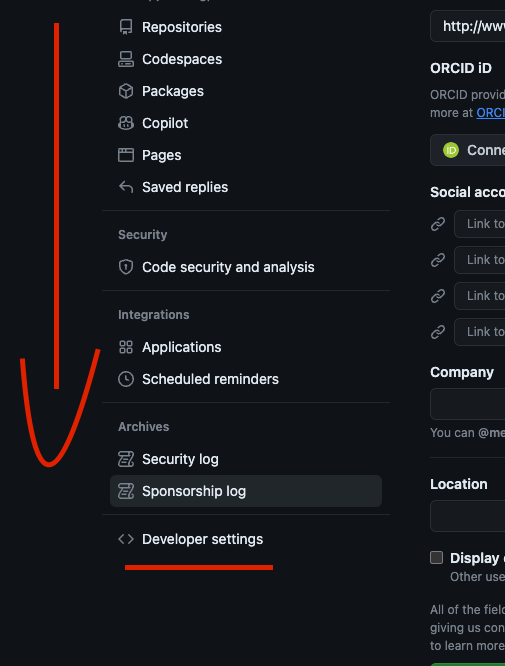

Then select "Personal Access Token" and "Fine-grained Tokens". Then "Generate New Token".

On the next screen, select your token name and expiration length. For the resource owner, you should see organization who invited collaborators. Under "Repository Access", select "All repositories".


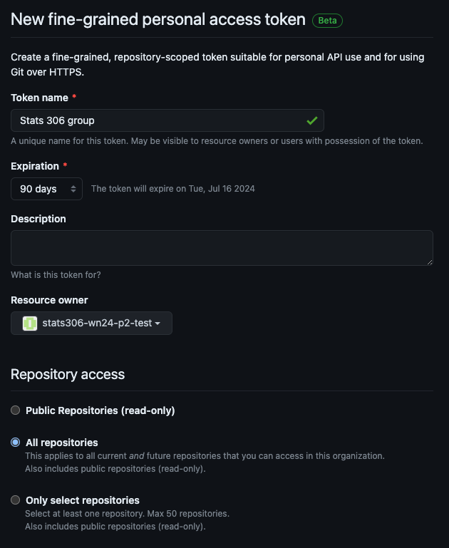


Under "Permissions", select the "Repository" section. Scroll down to find "Contents" and set this to the "Read and Write" option. Scroll to the bottom and generate your token.

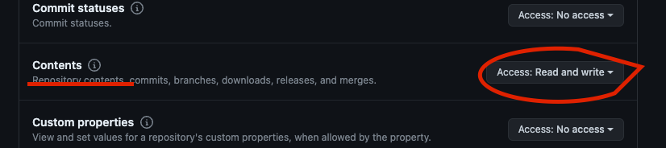


Copy the token and store it somewhere safe. If you use a password manager for your web browser, you can store it there. We will copy it to posit cloud shortly, so you will not need to access it frequently, but you may need it later. After you close this page, you will not be able to retrieve it from github.


## Creating Posit Cloud Projects

Each team member should create a new Posit Cloud project in the Stats 306 workspace.

In your Terminal tab, run the following commands:

```
git init .
git config user.name "Your Name"
git config user.email "Your Email Address"
git config credential.helper store
```

Go to GitHub and retrieve the `https://github.com/...` version of the URL to your repository.
  
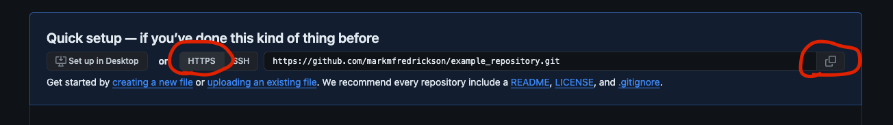


Back in the terminal in Posit Cloud run the following commands:

```
git remote add origin HTTPS_URL
git remote add upstream PROJECT_URL
```

Where `HTTPS_URL` is the URL you copied from GitHub and `PROJECT_URL` is the URL for the project. 

Designate one team member to do the following:

```
git pull upstream main
git branch -m main
git push origin main
```

During this process, the user will be prompted for a user name (this is your **GitHub username**, not your email) and your password. For the password, copy and paste in your PAT. You will not see the password, but after you paste it in, press enter.

This will bring the Project 1 materials into the shared team repository on GitHub

Now all members can run the following:

```
git pull --set-upstream origin main
git branch -M main
```

They will now get copies of the shared repository. Later, after adding and committing changes, you can use

```
git pull origin main
git push origin main
```

to retrieve and share your changes.

