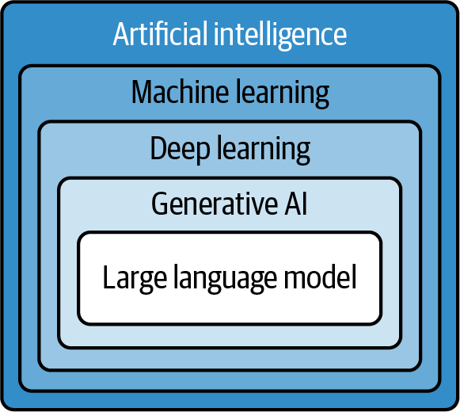
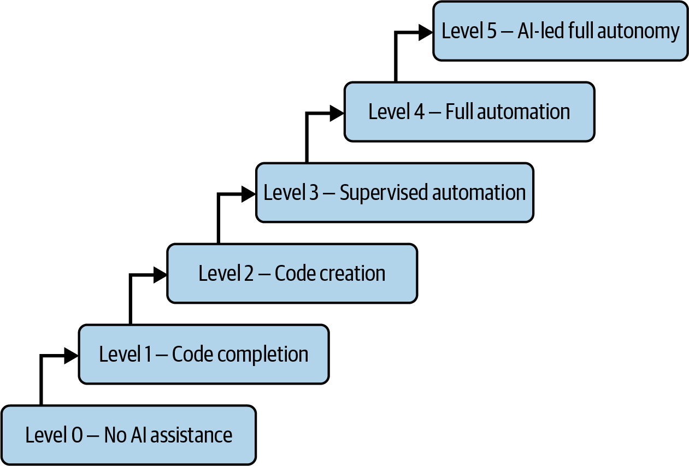

```{r setup, include=FALSE}
library(learnr)
library(tidyverse)
```

## R's help system

The documentation generated on the previous slide was in a format to be used in R's built in help system.

You can access it using the "Help" tab or directly from the console:

```{r, eval = FALSE}
?ggplot
```

Let's take a look at the documentation for the `ggplot` function.

Quick help for a function `formalArgs(fn_name)`.

```{r}
formalArgs(ggplot)
```


## What is Generative Artificial Intelligence?

You have no doubt heard of **generative artificial intelligence** (GenAI) such as ChatGPT.



* Artificial intelligence: the use of computer programs to mimic human thinking and reasoning (*models*)
* Machine learning: use of *probabilistic* tools that try to find regular structure in data
* Deep learning: A specific set of algorithms based on very large *neural networks* designed to mimic human brains
* Generative AI: AI tools that are used to *generate new material*, not just answer yes/no questions or produce simple numerical values
* Large language models: Models trained on very large collections of text data that generate text output (usually)

## What Are LLMs good for?

Because we can interact with LLMs by writing *natural language* prompts (rather than code like R), we have a lot of flexibility in how we can use them to support us when we are doing programming.

* Minimizing Search
* Advising Solutions for coding problems
* Interpreting and summarizing existing code
* Generating documentation
* Code integrity


## Shortcomings of LLMs

The technology is rapidly changing, so these will improve over time, but generally

* Hallucinations: making confident sounding statements that are factually incorrect.
* Intellectual property: LLMs are trained on existing code written by humans. Who owns the results it generate? 
* Privacy: Can sensitive data be included in the training set? Can the large training sets be used to infer private details not released in individual data sets?
* Security: If we accept the results of an AI assistant, do we know it is secure? Could security holes in included?
* Training data: representation gaps/bias, quality inconsistency, knowledge cutoff date, generalization gap, contextual understanding.
* Size of problems: limit prompt and results, better for small problems than large problems


## A bit of history and terminology

* Since the 1950s and 60s, most computing programming has been done with *programming languages* (as compared to graphical methods, e.g. Scratch).
* This code needs to be turned from human readable into machine executable instructions, which is done by a *compiler* or *interpreter*.
* Compilers analyze the program for correctness and structure, and these results can sometimes be used for *autocompletion* (think suggesting "happy" after you type "happ")
* Various *integrated development envirnoments* (like RStudio/Posit Cloud) have been continuing to create additional features to make programming tasks easier.
* AI assistants represent the next step of this development.

## Level's of Assistance

Slack's levels of AI assistance:


Current best-of-breed tools sit around level 3.

## How do LLMs work?

The explosion of large language models can be traced to three things:

1. Improvements in the *algorithms* (the method by which the models are built)
2. Faster hardware (GPU servers in cloud based data centers)
3. Access to very large training data sets (e.g., the whole internet or all of GitHub)

We won't go into the low level details (much more in AAP chapter 2), but at a basic level:

- The training data is turned into *tokens*. E.g., "What is ChatGPT" might become the tokens `What`, `is`, `Chat`, `G`, `P`, `T`.
- The *model* is built to answer the question, "given the tokens we have seen so far, what tokens most often come next?"
- Prompts are turned into tokens and the model *predicts* what tokens come next.
- There are many tuning parameters and the predictions are often randomly generated, so results may vary widely across uses.


## Prompt Engineering

The field of *prompt engineering* is an emerging study of how to best write prompts for LLMs.

The skills of propt engineering are very similar to those of computer programming generally: how can you break down large goals into smaller, more digestible pieces? We call this *problem decomposition*.

In doing so, here are some challenges:

* Wordiness: LLMs can spit out very long results. Including the word "concise" can be very helpful!
* Non-transferability: Skills built for one model (or even version of a model) may not work for other models.
* Length sensitivity: There are limits to how much input you are allowed. Asking follow up prompts can help.
* Ambiguity: We need to be specific in what we ask of the LLM to get out the results we need.

## Writing Prompts

Most LLMs have some variation on the following structure:


- System/Context: A short description (in text) to start the session. Popular to write these in the second person: "You are a R programmer."
- Instructions: What do you want the LLM to do?
- Input content: Things for the LLM to process, such as a few lines of code or a data set.
- Format: How do you want the result output? For example, description or documentation?

There will also be parameters that can be manipulated to shorten or length respones, increase or decrease the probability of unusual results, but we will focus using default settings in this course.

## System/Context

Begin by giving the AI a general description of the setting for the problem or a *persona* you want the AI to use. 

For example, you might consider selecting "You are an advanced R user" if you want very terse code or "You are a beginning R programmer" if you want more basics and explanation.

## Instructions

This is the core of the prompt. What should the LLM produce? 

Some common tasks include:

* Summarizing a large body of text/code
* Explaining text or code in other terms
* Text classification of documents to infer tone or emotional content
* Translation of one langauge (natural language or progamming language) into another
* Completing a function definition or skeleton code
* Turning pseudo-code into actual code
* Finding bugs (problems in code) or explaining error messages

## Content

In this part of the prompt, we include some additional context:

* Data for the LLM to operate on
* An existing function or R expression
* Documentation

It is often useful to put the content between *delimiters* such as `"""` or `###`.

For example:

```
You are an experienced R programmer.

Here is the documentation for the ggplot function. Explain how I can use this function to make a plot of data contained in a variable called `mytable`.

###
Usage

ggplot(data = NULL, mapping = aes(), ..., environment = parent.frame())
Arguments

data
Default dataset to use for plot. If not already a data.frame, will be converted to one by fortify(). If not specified, must be supplied in each layer added to the plot.

mapping
Default list of aesthetic mappings to use for plot. If not specified, must be supplied in each layer added to the plot.

...
Other arguments passed on to methods. Not currently used.

environment
[Deprecated] Used prior to tidy evaluation.

###
```

## Format

Finally, you may want to get the output formatted in a specific way.

* For text, you might ask for parargaphs or bullet points.
* For documentation, you might need it in a specific format for automatic documentation generation.
* For data, you might want it in a particular file type/format
* You can use this to format things in markdown for your RMarkdown documents

## Exercise

<!-- Note: this may need to be updated with future releases and/or internet connected models -->

* Our goal will be to summarize [this article about research on different education techniques](https://news.umich.edu/one-size-doesnt-fit-all-u-m-study-reveals-different-educational-models-can-lead-to-college-success/). 
* Open up [UMGPT](https://umgpt.umich.edu/) and start a *GPT-Turbo* session (the default).
* Paste in the URL of the article and ask UMGPT to summarize it. Read over this summary.
* Also ask who the author is and when the article was published. Is this correct?
* Now try pasting the text of the document. Repeat the previous steps.
* Try some different contexts/personas and use instructions like "concisely summarize" or "summarize using 5 bullet points" to control the wordiness of the result.

## Best Practices

* Be specific: give enough detail that the model can accurately predict what you want
* Define acronyms and jargon: don't rely on the system to know the definition of every abbreviation or term you use
* Provide several examples/content blocks ("few-shot learning"): Give multple examples so that system can simultaneously address them
* Leading words/code: Start the solution using a phrase or short bit of starter code
* Chain-of-thought: ask a series of smaller questions and follow up to fine tune the results. You can ask the system to ask you questions as well.
* Avoid *leading questions* that bake in an answer.

<!-- TODO: Add some more exercises here -->
