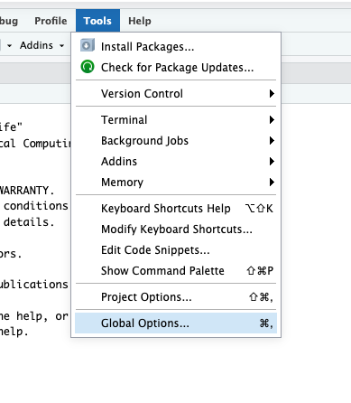
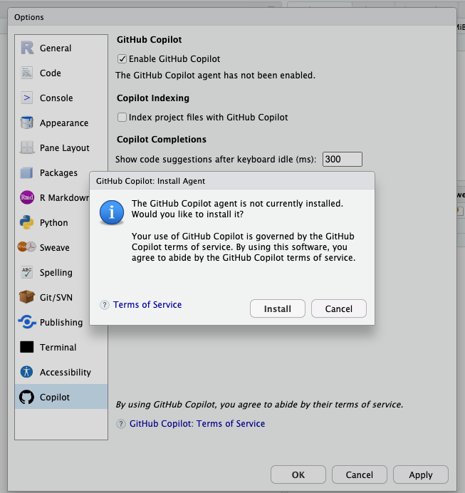
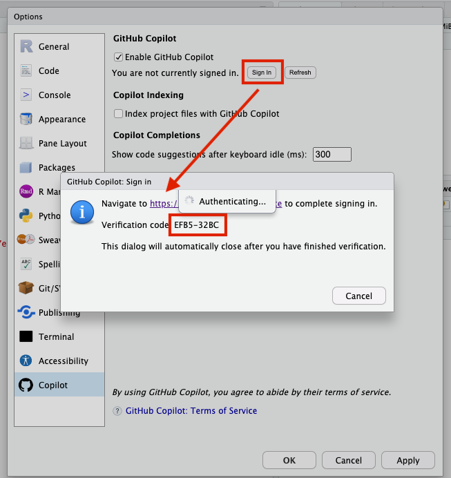

```{r setup, include=FALSE}
library(learnr)
library(tidyverse)
```

## A programming specific LLM

In the previous lecture we used UMGPT as our AI tool. Going forward, we will use GitHub's Copilot.

* Trained on open source softare projects hosted on GitHub
* Integrates with IDEs, including RStudio/Posit Cloud
* Free with GitHub Education (paid services also available)

## Getting Started

Connecting Copilot to your Posit Cloud project is not hard, but *you must connect each new project* you start.








<!-- TODO: Create a project that students can use for some examples -->

Open up the "Example HW" project and connect it to Copilot.

## Interacting with Copilot

Copilot will now be running in your project.

When you open a .Rmd or .R file, Copilot will make suggestions in gray text. Hit "Tab" to accept them. Hit "enter" or keep typing to ignore them.

You can use Copilot with both the markdown and R code chunks, but I find it works best in the R chunks.

## Copilot in R code

Using comments (`#` lines) we can instruct Copilot what we want it to do. For example,

```{r}
# write a function to compute the geometric mean of a set of values
```

This generated

```{r}
geometric_mean <- function(x) {
  n <- length(x)
  prod(x)^(1/n)
}

# test the function
geometric_mean(c(1, 2, 3, 4, 5)) # 2.605171
```


## Exercise

Using the `Example HW` project where we enabled Copilot, open `Example_HW.Rmd`.

Create a new code chunk. Use Copilot to create a graph based on the `diamonds` data set.

## Giving cues to Copilot

While Copilot can often just build off your comments, a few hints can be helpful.

1. Write multiple line comments with more directions.
2. Write "# prompt:" to differentiate this from other comments.
3. If you have a question you can write:

```{r}
# q: What are the arguments to the ggplot function? 
```
Hit enter, and Copilot responds:
```{r}
# a: The arguments to the ggplot function are data and aesthetics (aes).
```

* The space between the `#` and `q:` is important.
* Sometimes you need to add the `# a:` prompt to get Copilot to give you an answer.

## Exercise

Copy this function into a new code chunk in `Example_HW.Rmd`. Use the question and answer feature to find out what it does. 
```{r}
xyz <- function(x, y, z) {
  rep(x, y) |> paste(collapse = z)
}
```

## My results

These can vary for individual sessions, but this is what I got:

```{r}
xyz <- function(x, y, z) {
  rep(x, y) |> paste(collapse = z)
}

# q: what does the function xyz do?
# a: The function xyz repeats the string x y times and concatenates them with the string z.

xyz("hello", 3, " ")
```

## Copilot Workflow

1. Write a comment with a prompt.
2. Hit enter to get Copilot's response.
3. Accept the response by hitting "Tab" or keep typing to ignore it.
4. Test the result to make sure it works as expected.

## Exercise

Use Copilot to create a function that computes the median absolute deviation of a collection of numbers (R calls this a vector). MAD is defined as:

$$\text{MAD}(X) = \text{median}(|X - \text{median}(X)|)$$

Verify your function works by computing the median absolute deviation of the values 1 to 5. The MAD should be 1. Here is a little code to get you started:

```{r}
x <- 1:5
```

Note: Copilot will try to tell you the output of the function you just wrote. This can be helpful, but it is not always correct. Verify it yourself by running the chunk in the Console by pressing "Ctrl + Shift + Enter" or "Cmd + Shift + Enter".

## My Results

```{r}
# write a function to compute the median absolute deviation of a set of values
median_abs_dev <- function(x) {
  median(abs(x - median(x)))
}

# apply the median_abs_dev function to x
x <- 1:5
median_abs_dev(x) # 1

```

## Using Copilot to help you diagnose problems (debugging)

When we write code (or use Copilot to do it), we will encounter errors. Copilot can help us diagnose these errors.

For example, if we write:

```{r, eval = FALSE}
# write a function to compute the median absolute deviation of a set of values
median_abs_dev <- function(x) {
  median(abs(x - median(x))
}
```

When we run this chunk we will get the error:

```
Error: unexpected '}' in:
"  median(abs(x - median(x))
}"
```

If we ask Copilot what the error is, it will tell us (real q/a interaction with Copilot):


```{r}
# q: What is the error in the median_abs_dev function?
# a: The error in the median_abs_dev function is an unexpected '}'.

# q: where is the error in the median_abs_dev function?
# a: The error in the median_abs_dev function is on line 3.

# q: how can I fix this error?
# a: You can fix this error by adding a closing parenthesis to the median function.

# q: rewrite the function to fix the error
# a: median_abs_dev <- function(x) {
#   median(abs(x - median(x)))
# }
```

This doesn't always work, but often we can get good information on what is going on.

## Exercise

Copy the following code into a new code chunk in `Example_HW.Rmd`. Use Copilot to help you diagnose the error.

```{r, eval = FALSE}
xyz <- function(x, y) {
  ratio <- (x + y) / z
  return(ratio)
}

xyz(12, 10)
```

## My results

```{r, eval = FALSE}

xyz <- function(x, y) {
  ratio <- (x + y) / z
  return(ratio)
}

xyz(12, 10)
# I copied the next line in:
# Error in xyz(12, 10) : object 'z' not found

# q: What does this error mean?
# a: The error "object 'z' not found" means that the variable z is not defined in the function.

# q: how can I fix this error?
# a: You can fix this error by defining the variable z in the function.

# q: how do I do that?
# a: You can define the variable z by adding it as an argument to the function.
```

```{r}
# rewrite the function with the z argument added
xyz <- function(x, y, z) {
  ratio <- (x + y) / z
  return(ratio)
}

xyz(12, 10, 2)
```

In this case, if you want to run the entire chunk, you need to remove or comment out the line `xyz(12, 10)`. Or you can use "Ctrl + Enter" or "Cmd + Enter" to run lines one at a time.


## R: a language for samples

Recall that R is a **statistical** programming language. In statistics we often work with:

>* **Samples**, composed of individual units
>* **Variables**, something measured on each unit in the sample

Tabular data: columns are variables, rows are observations

## Lists and Vectors

* A **vector** is an ordered collection of the same type of data. Created using the `c` function (concatenate).
* A **list** is an ordered collection of (potentially) different types of data. Created using the `list` function.
* Both can have **names** to indicate individual items.
* Lists can serve a similar role to dictionaries and hash tables in other languages.

## Vectors, basic

```{r}
phone_digits <- c(8, 6, 7, 4, 3, 0, 9)
phone_plus_area_code <- c(7, 3, 4, phone_digits)
length(phone_plus_area_code)
sum(phone_plus_area_code)
```

## Vectors, indexing

The `runif` function will create randomly generated values in the range (0, 1).

```{r}
random_u01 <- runif(10) # create 10 values
print(random_u01)
random_u01[1] # first item
random_u01[10] # last item
random_u01[-1] # all but first
random_u01[1:3] # first three
random_u01[3:6] # a "slice" in the middle
random_u01[c(1, 3, 7, 1)] # arbitrary choices
```


## Exercise

Pull out the last three items in the vectors `letters`. A little help to get you started:

```{r lettersxyz, exercise = TRUE}
length(letters)
```


```{r lettersxyz-solution}
letters[c(24, 25, 26)]
letters[-(1:23)]
```

## Relational Operators

```{r}
x <- 1
y <- 2

x < y
x > y
x <= y
x >= y
x == y
x != y

!(x == y) # negation
```

## Vectorized computations

In the previous slide we compared two *scalar values* (i.e., single numbers). The result was a scalar *logical* value.

```{r}
x <- 3
y <- 10
x > y
```

We can also compare two vectors of the same length.

```{r}
x <- c(1, 2, 3)
y <- c(10, -1, 3)

x < y
```

We call operations on collections of data like this *vectorized computations.*

## Other vectorized computations

We can also operate on vectors with vectorized computations using airthmetic operators.

```{r}
x <- c(1, 2, 3)
y <- c(10, -1, 3)
x + y
2 * x
```

Notice that we multiplied a vector of length 1 (`2`) by a vector of length 3 (`x`). This is called *recycling* and is a common feature of R.

```{r}
# 2 * x is the same as:
c(2, 2, 2) * x
```

Be careful if you see this warning message:

```{r}
c(2, 2) * c(3, 3, 3)
```

It means to tried to operate on two lists of different sizes where one could not be evenly recycled to match the other. Usually, this indicates a programming error.


## Lists, heterogenous collections

Vectors must be the same type, lists can be **heterogeneous**:
```{r}
list("string", 7, 1:4)
```

## Named collections

Vectors can have names (`c(first = 1, second = 22, third = 333)`), but names for lists are more common.
```{r}
named_list <- list(a_string = "A string", a_vector = 1:4)
named_list[["a_string"]] # note double brackets
named_list$a_vector
```

## Tables: Lists of Vectors

* In a **sample**, we suppose we have $k$ variables measured for each of $n$ units.
* For each variable, place the $n$ values in a vector.
* Collect all such vectors into a list of length $k$.
* Result: $n \times k$ table

## Tables in R

There are a few different types of tables in R (`data.frame`, `tibble`). We will treat them interchangeably for the most part.

```{r}
class(mpg)
dim(mpg)
colnames(mpg)
head(mpg)
```

## Accessing individual columns

Recall, the `$` operator lets us get items from lists:

```{r}
mpg$hwy |> mean() # equiv to mean(mpg$hwy)
```

## Functions for basic descriptive statistics

```{r}
sum(mpg$hwy)
mean(mpg$hwy)
var(mpg$hwy)
sd(mpg$hwy) 
median(mpg$hwy)
IQR(mpg$hwy)
quantile(mpg$hwy, c(0.25, 0.75))
```

## Exercise

What is the average `year` of the cars in `mpg`? What is the standard deviation of the city mileage (`cty`)?

```{r mpgsummary, exercise = TRUE}

```

```{r}
mean(mpg$year)
mpg$cty |> sd()
```

## Vectorized computations with with columns

Since the columns of a table are *vectors*, we can perform vectorized computations on them.

The `mpg$cty` column is in *miles/gallon*, let's convert to *km/l*.

```{r}
cty_km_l <- mpg$cty * 1.60934 / 3.78541 # miles/gallon to km/l
cty_km_l[1:5] # first five values
```

## Storing new columns

We can store the new column in the table by assigning it to a new column name.

```{r}
mpg$cty_km_l <- cty_km_l
mpg$cty_km_l[1:5]
```

We will see even better ways of doing this soon.


